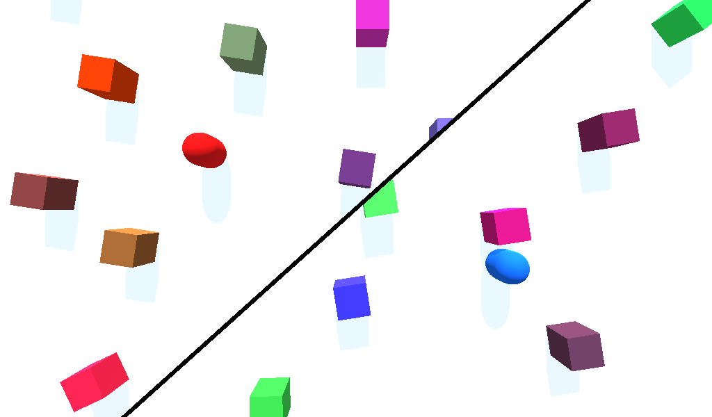

# Dynamic Split Screen

This sample project showcases an implementation of dynamic
split screen, also called Voronoi split screen.

Language: [GDSL](https://docs.godotengine.org/en/latest/tutorials/shaders/shader_reference/shading_language.html) and GDScript

Renderer: GLES 2

Note: An HTML5 export is testable
[here](https://benjaminnavarro.github.io/godot_dynamic_split_screen/index.html).

Check out this demo on the asset library: https://godotengine.org/asset-library/asset/541

## Table of Contents

- [Introduction](#introduction)
- [Features](#features)
- [Technologies](#technologies)
- [Installation](#installation)
- [Usage](#usage)
- [Documentation](#documentation)
- [Contributing](#contributing)
- [License](#license)
- [Contact](#contact)

## Introduction

Provide a more detailed overview of your project, explaining its background, motivation, and goals. Discuss the problem it aims to solve and how it adds value or benefits users.

## Features

List and describe the key features of your project. This section should highlight your practical skills and demonstrate your ability to create functional and useful software solutions.

## Technologies

Outline the technologies, frameworks, libraries, and programming languages utilized in your project. Mention any notable tools or platforms that you employed during development. This section helps employers gauge your technical expertise.

## Installation

Provide step-by-step instructions for setting up and running your project locally. Include any dependencies or prerequisites needed to run the code successfully. This demonstrates your ability to communicate effectively and document the necessary setup processes.

## Usage

Describe how to use your project and demonstrate its functionality. Provide examples or screenshots if applicable. Employers can evaluate your ability to create user-friendly interfaces and intuitive software experiences.

## Documentation

Include links or references to any additional documentation you have created for your project. This could be API documentation, user guides, or any other relevant resources. By showcasing comprehensive documentation, you exhibit your commitment to thoroughness and your capacity to communicate complex concepts.

## Contributing

If your project is open-source and you are open to contributions, describe how others can contribute to your project. Include guidelines for pull requests, issue reporting, and code formatting. This demonstrates your collaboration skills and your ability to work effectively with others.

## License

Specify the license under which your project is released. Mention any limitations or conditions associated with the use of your code. It is essential to adhere to licensing best practices and respect intellectual property rights.

## Contact

Provide your contact information, such as your email address or a link to your professional website. This allows potential employers to reach out to you with inquiries or opportunities.

## Conclusion

Summarize your project and reiterate its significance. Express your enthusiasm for programming and emphasize your dedication to continuous learning and improvement.

=====================

## Details

A dynamic split screen system displays a single screen when
the two players are close but a splitted view when they move apart.

The splitting line can take any angle depending on the players'
position, so it won't be either vertical or horizontal.

This system was popularized by the Lego videogames.

## How it works

Two cameras are placed inside two separate viewports and their
texture, as well as some other parameters, are passed to a
shader attached to a TextureRect filling the whole screen.

The `SplitScreen` shader, with the help of the `CameraController`
script, chooses wich texture to display on each pixel to
achieve the effect.

The cameras are placed on the segment joining the two players,
either in the middle if they're close enough or at a fixed
distance otherwise.

## How to use it

Open and launch the project inside the Godot engine and then
you can use WASD keys to move the first player and IJKL keys
to move the second one.

The `Cameras` node has parameters to tune the distance at
which the screen splits and also the width and color of
the splitting line.

## Screenshots

"# Dynamic-Split-Screen-for-2D-Games" 
